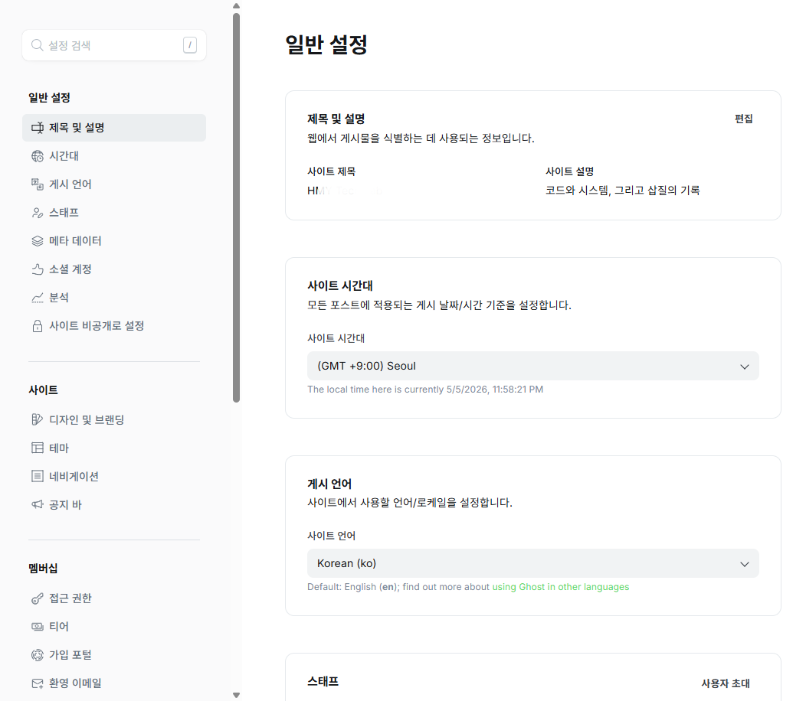
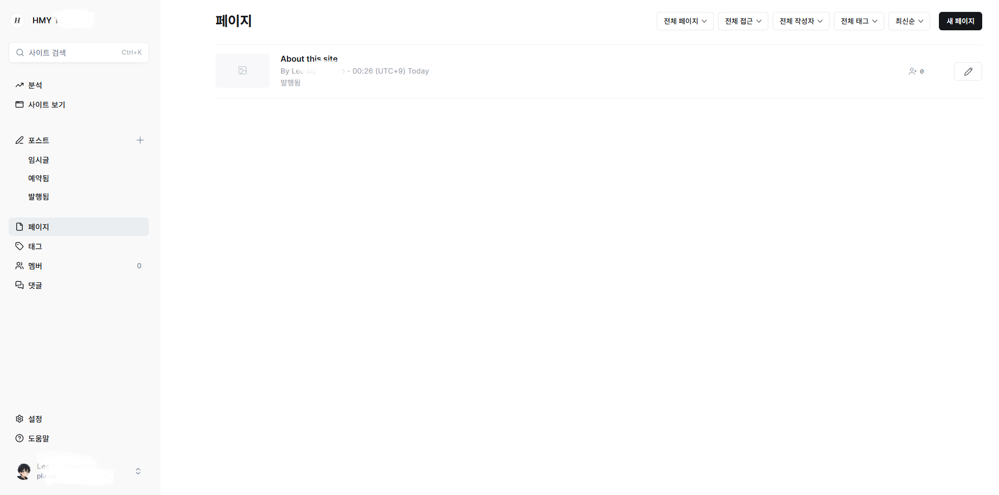

# ghost-admin-ko-patch

Ghost 관리자 페이지(`/ghost`)를 한국어로 보강하기 위한 사용자 스크립트 패키지입니다.

이 저장소는 [TryGhost/Ghost](https://github.com/TryGhost/Ghost)의 **Ghost Admin UI**를 대상으로 하며,
공식 i18n 기능이 아닌 **스크립트 주입 방식**으로 영문 UI 텍스트를 한국어로 치환합니다.

## 대상

- **원 프로젝트**: [TryGhost/Ghost](https://github.com/TryGhost/Ghost)
- **대상 영역**: `https://your-domain.com/ghost`
- **용도**: Ghost Admin UI 한글 보강

## 포함 파일

- `ghost-admin-ko.js`
  - 관리자 UI의 텍스트와 일부 속성값을 한국어로 치환하는 브라우저 스크립트
- `inject-admin-ko.sh`
  - Ghost Admin `index.html`에 위 스크립트를 주입하는 셸 스크립트

## 전제 조건

- Docker 기반 Ghost 운영 환경
- Ghost Admin 정적 파일 경로 접근 가능
- Ghost 컨테이너에 `docker cp`, `docker exec` 사용 가능

Ghost 공식 Docker 이미지 기준 관리자 정적 파일 경로:

```text
/var/lib/ghost/current/core/built/admin
```

## 바꿔야 하는 값

README의 예시 명령에는 아래 값들이 포함되어 있습니다.

- **호스트 경로 예시**: `/volume1/docker/ghost/...`
- **컨테이너 이름 예시**: `ghost-blog`

이 두 값은 **각자 환경에 맞게 반드시 변경**해야 합니다.

반면 아래 경로는 Ghost 공식 Docker 이미지 기준 내부 경로입니다.

```text
/var/lib/ghost/current/core/built/admin/assets/ghost-admin-ko.v2.js
```

## 설치 방법

### 1. 호스트 서버에 파일 업로드

예시:

```bash
scp ghost-admin-ko.js user@server:/your/host/path/ghost-admin-ko.js
scp inject-admin-ko.sh user@server:/your/host/path/inject-admin-ko.sh
```

### 2. 컨테이너에 복사 및 주입

예시:

```bash
docker cp /your/host/path/ghost-admin-ko.js ghost-blog:/var/lib/ghost/current/core/built/admin/assets/ghost-admin-ko.v2.js
docker cp /your/host/path/inject-admin-ko.sh ghost-blog:/tmp/inject-admin-ko.sh
docker exec ghost-blog sh /tmp/inject-admin-ko.sh
```

### 3. 브라우저 확인

- `/ghost` 관리자 페이지 접속
- `Ctrl + F5`로 강력 새로고침
- 필요하면 시크릿 창에서 확인

## 동작 방식

- `inject-admin-ko.sh`가 Ghost Admin `index.html`의 `</body>` 앞에 스크립트를 주입합니다.
- `ghost-admin-ko.js`는 `MutationObserver` 기반으로 동적으로 렌더링되는 UI 텍스트를 한국어로 치환합니다.
- 일부 값은 `placeholder`, `aria-label`, `title`, `data-label` 속성도 함께 치환합니다.

## 스크린샷

### 설정 페이지 한글화 예시



### 페이지 목록 한글화 예시



## 업데이트 후 재적용

Ghost 컨테이너를 재생성하거나 Ghost를 업데이트하면 Admin 정적 파일이 원본으로 돌아갈 수 있습니다.

그 경우 아래 명령을 다시 실행하면 됩니다.

```bash
docker cp /your/host/path/ghost-admin-ko.js ghost-blog:/var/lib/ghost/current/core/built/admin/assets/ghost-admin-ko.v2.js
docker cp /your/host/path/inject-admin-ko.sh ghost-blog:/tmp/inject-admin-ko.sh
docker exec ghost-blog sh /tmp/inject-admin-ko.sh
```

## 제한 사항

- Ghost 공식 i18n 시스템이 아닙니다.
- Ghost 버전이 크게 바뀌면 일부 항목은 다시 보강이 필요할 수 있습니다.
- 안정성을 위해 번들 파일 직접 수정 방식은 제외했고, 현재 저장소는 **스크립트 주입 방식만 사용**합니다.
